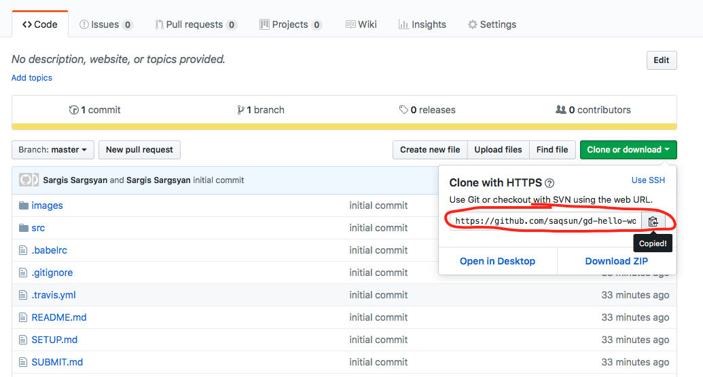

## Setup

To setup your homework you should first clone this repository.

To do so you should follow this steps:

0.  Install git
1.  Clone the repository:

```sh
git clone [your repository url]
```



2.  Go to cloned directory

1.  Create new `dev` branch:

```sh
git checkout -b dev
```

4.  Do your homework

1.  (optional, but recommended) Run tests locally (follow [setup](SETUP.md)).
1.  If you are happy with the tests results continue, if not go to `4`.

To run tests locally you should have Node.js installed.

**Mac OS X users**: you will find official
installers on [Node.js](https://nodejs.org/en/) downloads. Choose the LTS version.
It will install Node.js and npm on your machine.

**Linux users**: there are binaries for node and npm tools on the
[Node.js](https://nodejs.org/en/) downloads page, but the recommended way to install them on a
Linux machine is via a package manager. As of writing this, the
recommended version of Node.js to install is 8.x. To install it on a
Debian or Ubuntu Linux distribution just execute these commands:

```sh
curl -sL https://deb.nodesource.com/setup_8.x | sudo -E bash -
sudo apt-get install -y nodejs
```

## Running the test suite

You should install node modules to run the tests. To do so, navigate to the cloned repository and run the following command in your terminal:

```sh
npm install
```

After it is finished you can run:

```sh
npm test
```

It will show passed and failed tests.
