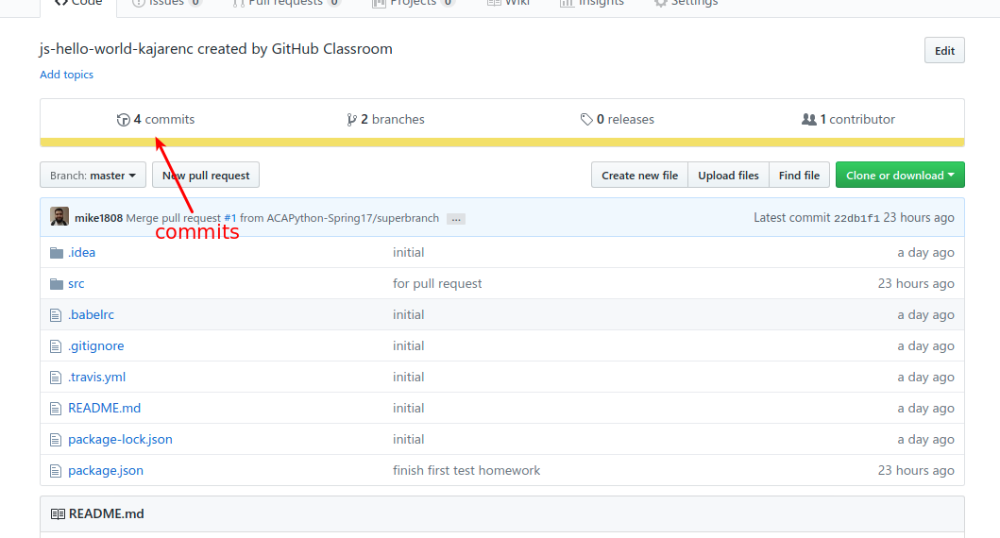
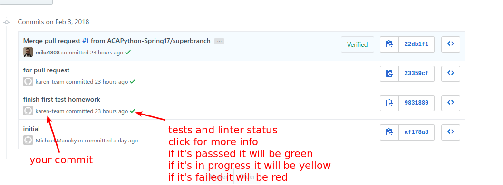
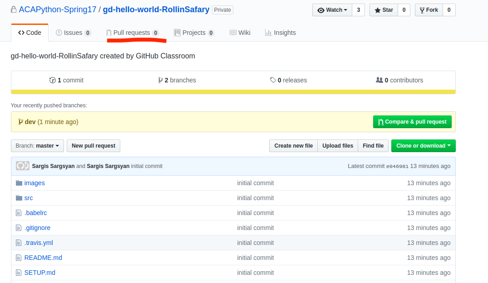
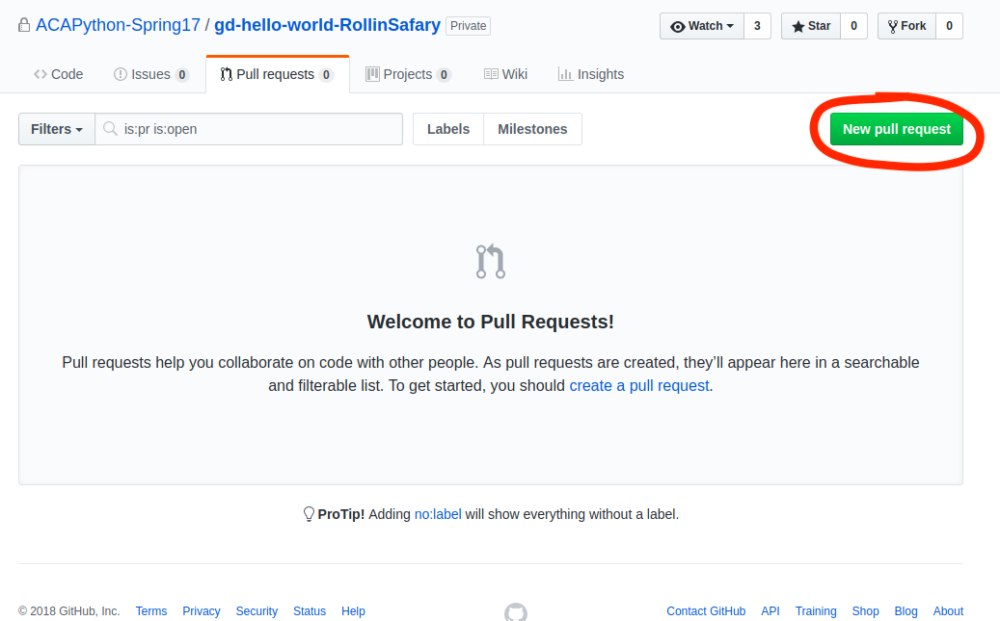
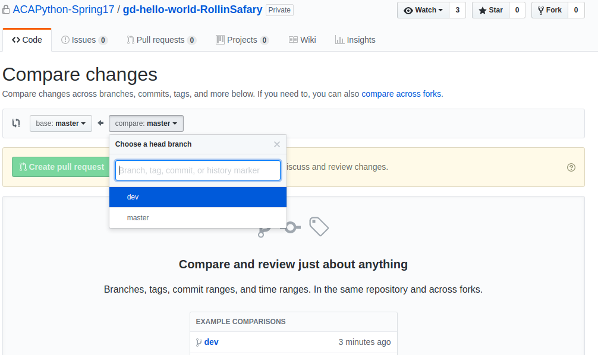
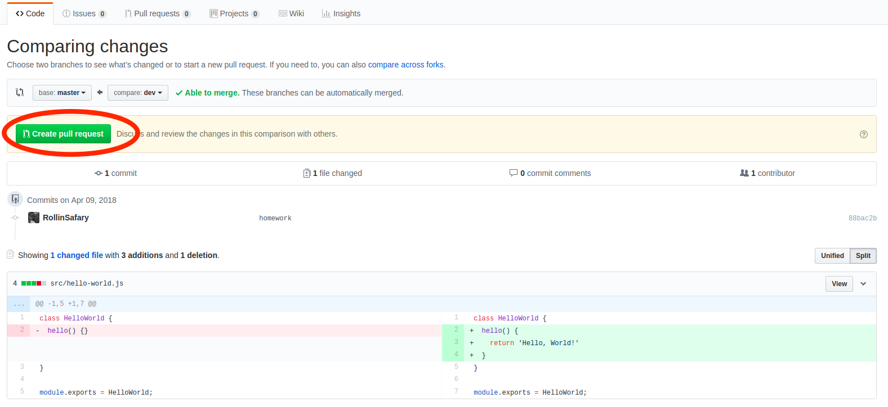
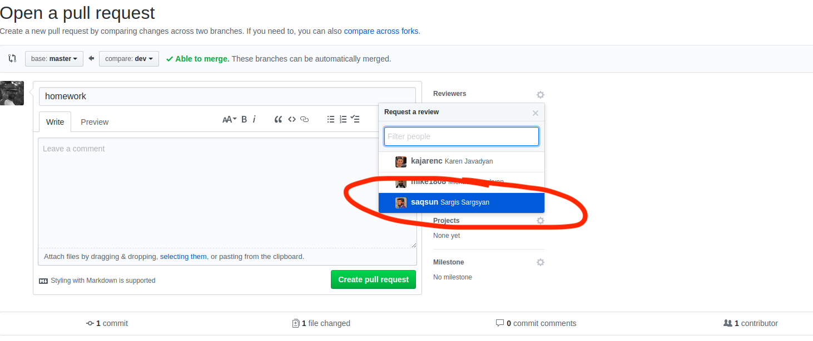
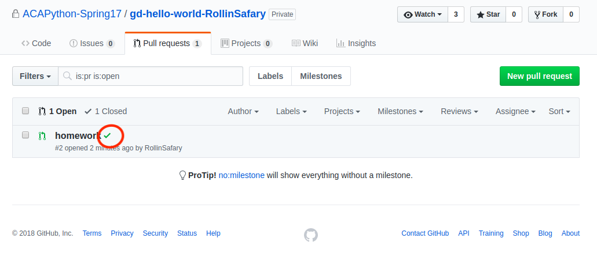

# Homework submit

To submit your homework you should commit your changes and push them to
`master` branch.

To do so you should follow this steps:

1.  Add your files to the staging:

```sh
git add .
```

2.  Commit your changes

```sh
git commit -m 'your commit message'
```

3.  Push your commit to GitHub

```sh
git push -u origin dev
```

When you push your commit to GitHub you can see it in the commits
section of your repo:



In the commit sections you can see your individual commits and their
tests status:



Create a pull request form your dev branch to master and add me as a reviewer.

1.  
1.  
1.  
1.  
1.  
1.  
